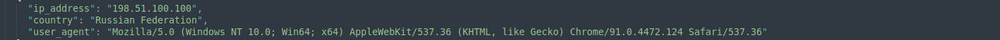
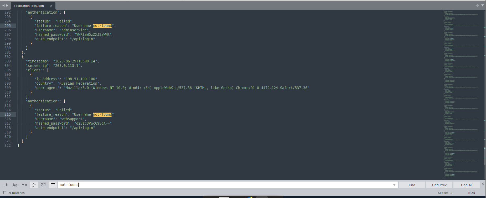
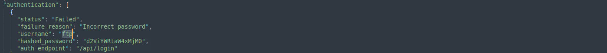
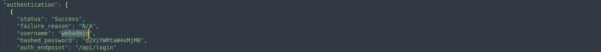
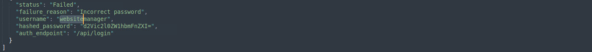
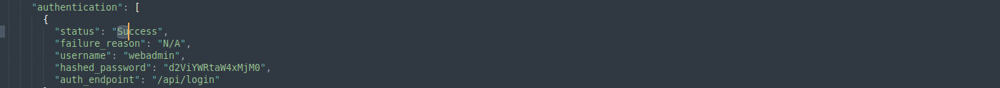
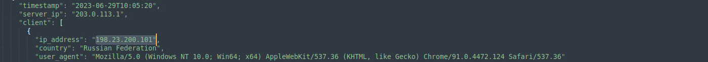
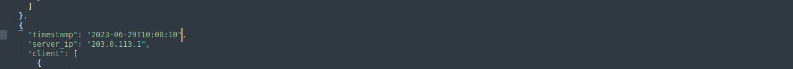
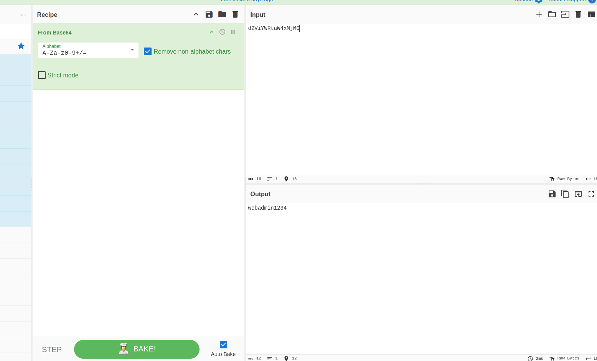

# Crack — BTLO Investigation Walkthrough

> **Platform:** Blue Team Labs Online (BTLO)
> **Category:** JSON Crack / Linux CLI · **Difficulty:** Easy · **Points:** 25
> **MITRE ATT&CK:** T1078.003 (Valid Accounts: Local Accounts), T1133 (External Remote Services)

---

## Scenario

> Use JSON Crack to investigate failed login attempts to a website.
>
> You can launch JSON Crack locally by having a terminal within this folder on the Desktop, and running the command: `sudo docker run -p 8888:8080 jsoncrack`. Leave this terminal open. Open the JSON Crack web GUI by navigating to `http://localhost:8888`.

The data we are given is a single file on the Desktop — **`application-logs.json`** — containing a series of authentication events against a web app's `/api/login` endpoint. Our job is to read those events and answer questions about the attacker and the accounts they targeted.

---

## Tools used

| Tool | Why |
|------|-----|
| **JSON Crack** (`localhost:8888`) | Visualises the JSON as an interactive node graph. Good for *seeing the shape* of the data. |
| **Sublime Text** | The workhorse for this lab — `Ctrl+F` and **Find All** make counting and filtering trivial. |
| **CyberChef** | Decoding the Base64 `hashed_password` field. |

### Setup note (and a gotcha)

JSON Crack is **only a viewer** — it doesn't compute anything you can't read straight from the file. So if the Docker container is slow to start or hangs on the `Loading Editor…` screen, you are not blocked: every answer in this lab can be pulled directly from `application-logs.json` in a text editor.

If you *do* want the visual editor:

```bash
# run from a terminal inside the folder on the Desktop
sudo docker run -p 8888:8080 jsoncrack
# then open http://localhost:8888 in Firefox
```

If it sticks on `Loading Editor…`, a hard refresh (`Ctrl + Shift + R`) usually clears it. Any console errors mentioning `servedby-buysellads` or `sentry.io` are just blocked ads/telemetry from the sandboxed lab network — they are **not** the problem and can be ignored.

---

## Understanding the log structure

Every event in the file follows the same shape. Knowing this layout is the key to the whole investigation:

```json
{
  "timestamp": "2023-06-29T10:00:10",
  "server_ip": "203.0.113.1",
  "client": [
    {
      "ip_address": "198.51.100.100",
      "country": "Russian Federation",
      "user_agent": "Mozilla/5.0 (Windows NT 10.0; Win64; x64) AppleWebKit/537.36 (KHTML, like Gecko) Chrome/91.0.4472.124 Safari/537.36"
    }
  ],
  "authentication": [
    {
      "status": "Failed",
      "failure_reason": "Username not found",
      "username": "adminpanel",
      "hashed_password": "YWRtaW5wYW5lbA==",
      "auth_endpoint": "/api/login"
    }
  ]
}
```

The three fields that answer almost everything:

- **`client.ip_address`** → who is connecting.
- **`authentication.status`** → `Failed` or `Success`.
- **`authentication.failure_reason`** → this is the clever bit. It tells us *why* a login failed, which lets us distinguish real accounts from fake ones:
  - `"Username not found"` / `"User not found"` → **the account does not exist**.
  - `"Incorrect password"` → **the account exists**, the password was just wrong.
  - `"N/A"` (with `status: Success`) → **the account exists** and the login worked.

---

## The investigation

### Q1 — What IP address is performing the attack? *(2 pts)*

**Where to look:** `client.ip_address`, across the failed-login events.

Scanning the file, one client IP dominates every failed authentication attempt: it hammers `/api/login` over and over against many different usernames — the textbook signature of a brute-force / credential-stuffing run. A second IP (`198.23.200.101`) appears only **once**, and only on a *successful* login.



- `198.51.100.100` — source of the bulk of the failed brute-force attempts.
- `198.23.200.101` — appears once, walking straight in with a valid webadmin login (no failures) — i.e. the actual unauthorised access using cracked credentials.

**Answer:** `198.23.200.101`

---

### Q2 — What is the end of the user-agent string? *(2 pts)* — Format: `Chrome/...`

**Where to look:** `client.user_agent` on any of the attacker's events.

The full string is:

```
Mozilla/5.0 (Windows NT 10.0; Win64; x64) AppleWebKit/537.36 (KHTML, like Gecko) Chrome/91.0.4472.124 Safari/537.36
```

The question asks for the **end** of the string, starting at `Chrome/`. **Gotcha:** `Chrome/91.0.4472.124` on its own is rejected — "the end" means everything from `Chrome/` to the very last character, so you must include the trailing `Safari/537.36`.

**Answer:** `Chrome/91.0.4472.124 Safari/537.36`

---

### Q3 — How many accounts have authentication attempts, but don't exist on the application? *(3 pts)*

**Where to look:** `failure_reason` containing `not found`.

These are the accounts the attacker *guessed* that the application has never heard of. In Sublime:

1. `Ctrl + F` → search `not found`
2. Click **Find All**

The match counter shows **9**, and each hit sits on a distinct username — so 9 attempts = 9 unique non-existent accounts.



The non-existent usernames captured across the file include `webmaster`, `websitedev`, `websitedbadmin`, `websitebackup`, `adminpanel`, `adminservice`, and `websupport` (plus the remaining ones to total 9).

> **Tip:** "Number of accounts" means *distinct usernames*, not raw attempts. Here they happen to be equal because every guessed name is unique — but always sanity-check that before trusting the match count.

**Answer:** `9`

---

### Q4 — Usernames (alphabetical) of accounts that **do** exist *(3 pts)* — Format: `name, name, ...`

**Where to look:** events where `failure_reason` is `Incorrect password` **or** `status` is `Success`. If the system recognised the username (wrong password) or let it in (success), the account is real.

Three real accounts appear:

| Username | Evidence |
|----------|----------|
| `ftp` | `failure_reason: "Incorrect password"` |
| `webadmin` | `Incorrect password` **and** `Success` |
| `websitemanager` | `failure_reason: "Incorrect password"` |





Sorted alphabetically:

**Answer:** `ftp, webadmin, websitemanager`

---

### Q5 — Username for the account that has successful logins seen *(3 pts)* — Format: `user`

**Where to look:** `status: "Success"`.

`Ctrl + F` → search `"status": "Success"` (or just `Success`). Every successful authentication in the file resolves to the same account: **`webadmin`**.



**Answer:** `webadmin`

---

### Q6 — The other IP address that logged into this account — Format: `X.X.X.X`

**Where to look:** the two IPs that produced a `webadmin` `Success`.

`webadmin` is logged into successfully from **both** client IPs at different times:

- `198.51.100.100` — within the brute-force burst (it eventually guessed the right password).
- `198.23.200.101` — a clean, single successful login slightly later (`2023-06-29T10:05:20`).



With `198.23.200.101` accounted for in Q1, the other IP that also logged into the account is the brute-force source.

**Answer:** `198.51.100.100`

---

### Q7 — What endpoint is being used for the authentication attempts? — Format: `/path`

**Where to look:** `auth_endpoint` — present on every single event.

Every authentication attempt, failed or successful, hits the same path:


**Answer:** `/api/login`

---

### Q8 — Timestamp of the earliest authentication attempt

**Where to look:** the `timestamp` fields. Note the events are **not** in strict chronological order in the file, so don't just take the first record — scan for the smallest time value.

The earliest attempt in the dataset is `2023-06-29T10:00:10`.



**Answer:** `2023-06-29T10:00:10`

---

### Q9 — What is the password used for the account? *(decode question)*

**Where to look:** the `hashed_password` field on the `webadmin` success event.

The field is misleadingly named — it isn't a real one-way hash, it's just **Base64-encoded plaintext**. Take the value `d2ViYWRtaW4xMjM0` into [CyberChef](https://gchq.github.io/CyberChef/) and apply the **`From Base64`** operation:



```
d2ViYWRtaW4xMjM0   →   webadmin1234
```

**Answer:** `webadmin1234`

> **Why this matters:** "hashed_password" being base64 is a realistic finding — encoding is *not* encryption and *not* hashing. Anything Base64-encoded is trivially reversible and should never be treated as a credential-protection mechanism.

---

## Answer key

| # | Question | Answer |
|---|----------|--------|
| 1 | IP performing the attack | `198.23.200.101` |
| 2 | End of user-agent string | `Chrome/91.0.4472.124 Safari/537.36` |
| 3 | Accounts attempted that don't exist | `9` |
| 4 | Accounts that do exist (alphabetical) | `ftp, webadmin, websitemanager` |
| 5 | Account with successful logins | `webadmin` |
| 6 | Other IP that logged into the account | `198.51.100.100` |
| 7 | Authentication endpoint | `/api/login` |
| 8 | Earliest authentication attempt | `2023-06-29T10:00:10` |
| 9 | Password for the account | `webadmin1234` |

---

## Key takeaways

- **JSON Crack is a viewer, not an analyser.** It makes nested data easier to *see*, but a plain text editor with **Find All** does the actual investigative work in a lab this size. Don't get blocked by a hung container.
- **`failure_reason` is the linchpin.** "Username not found" vs "Incorrect password" is exactly how you separate fake accounts from real ones — that single field answers two of the higher-point questions.
- **Distinguish attempts from accounts.** A match count tells you *events*; the question often wants *distinct entities*. Always verify uniqueness.
- **Encoding ≠ protection.** A field called `hashed_password` that decodes cleanly from Base64 is a real-world red flag, not a hash.
- **Read carefully for "end of string" / exact-format questions.** `Chrome/91.0.4472.124` failing where `Chrome/91.0.4472.124 Safari/537.36` succeeds is a classic format trap.

---

*Not bad for a first one back after a 3-month break. :)*
