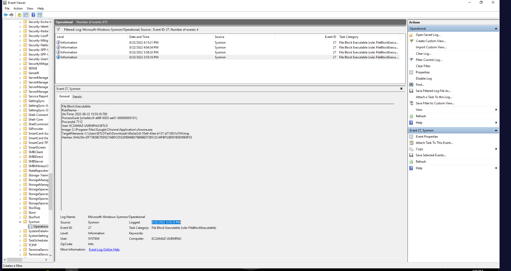
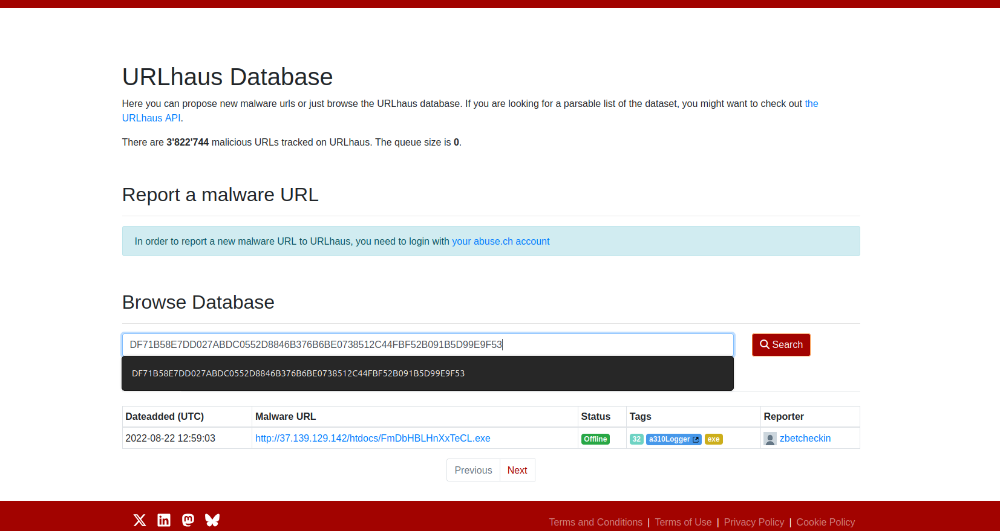
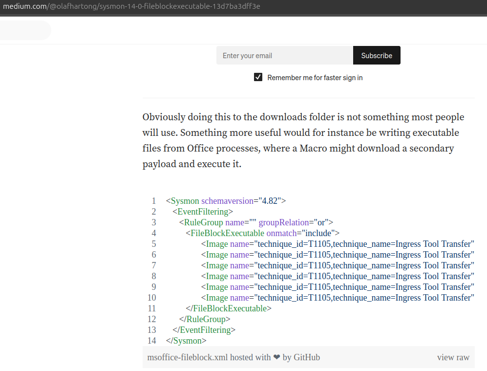
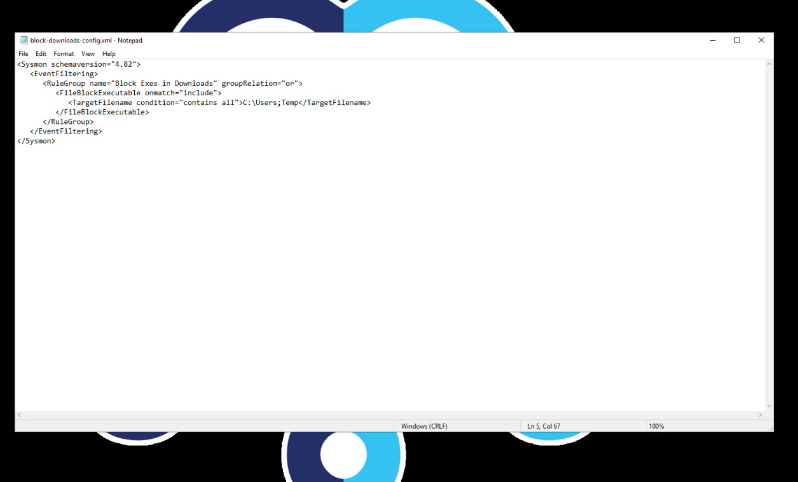
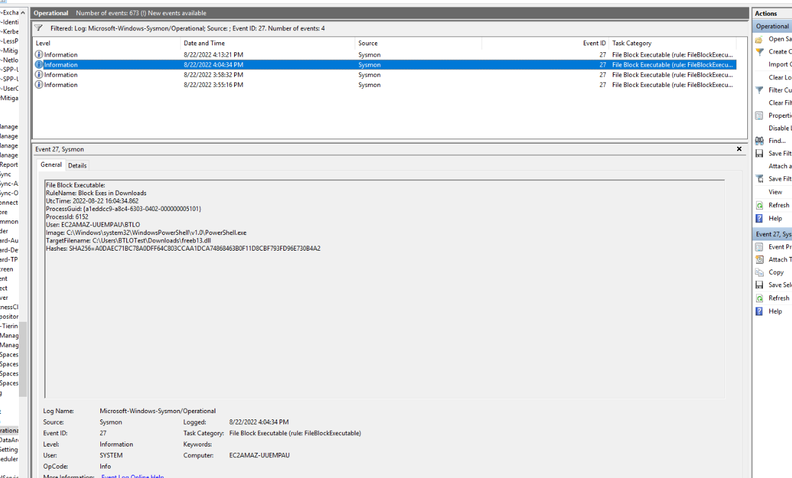
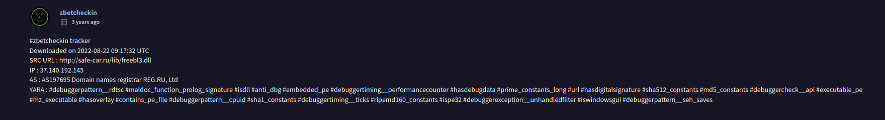

# BTLO Investigation Walkthrough — Sysmon 14 & FileBlockExecutable

## Overview

This investigation explores **FileBlockExecutable**, the preventative feature introduced in **Sysmon 14.0** (schema 4.82, released 16 Aug 2022). Unlike earlier Sysmon events that only *log* activity, FileBlockExecutable actively **blocks** the creation of executable files written to specified locations and records the action under **Event ID 27**.

The lab walks through reviewing blocked-download events in Event Viewer, pivoting on hashes via URLHaus and VirusTotal, and authoring/modifying Sysmon configuration rules.

**Environment notes:** Open Event Viewer as administrator (select the BTLO user if prompted) and navigate to `Applications and Services Logs > Microsoft > Windows > Sysmon > Operational`. Filter on **Event ID 27** to isolate the File Block Executable events (4 events in this dataset).

---

## Q1 — Timestamp of the first observed Event ID 27

**Method:** With the Operational log filtered to Event ID 27, four events are listed. Sorting by the Date and Time column, the earliest entry is the bottom one. Selecting it and reading the General tab confirms the time.



**Answer:**
```
8/22/2022 3:55:16 PM
```
The corresponding `UtcTime` field in the event body reads `2022-08-22 15:55:16.700`.

---

## Q2 — Image that initiated the file download (first 27 event)

**Method:** In the General tab of the 3:55:16 PM event (see screenshot above), read the `Image` field — this is the process that attempted to write the blocked file.

**Answer:**
```
C:\Program Files\Google\Chrome\Application\chrome.exe
```
The block was triggered by a file being downloaded through Google Chrome into the Downloads folder.

---

## Q3 — Malware name from the blocked file's hash (URLHaus)

**Method:** Copy the `Hashes: SHA256=...` value from the first 27 event:
```
DF71B58E7DD027ABDC0552D8846B376B6BE0738512C44FBF52B091B5D99E9F53
```
Search it in the **URLHaus** database (urlhaus.abuse.ch). The matching entry resolves to `http://37.139.129.142/htdocs/FmDbHBLHnXxTeCL.exe` and is labelled with several tags.



**Answer (from the tags):**
```
a310Logger
```

---

## Q4 — Line to block Microsoft Word from creating executables

**Concept:** FileBlockExecutable can key on the **initiating process** using the `<Image>` element. The `condition="image"` operator matches only the *filename* portion of the process path, so it works regardless of where Office is installed (e.g. `...\Office16\WINWORD.EXE`). The question states the `name` property is not required.



**Answer:**
```xml
<Image condition="image">winword.exe</Image>
```
In practice you would extend this to the rest of the Office suite (excel.exe, powerpnt.exe, outlook.exe, etc.) since macro abuse is not unique to Word.

---

## Q5 — Re-written line to block the OS-level Temp directory

**Context:** The provided `block-downloads-config.xml` blocks executables in the Downloads folder using a `contains all` match. The `contains all` operator requires the `TargetFilename` to contain **every** semicolon-delimited substring. The original Downloads rule used `C:\Users;Downloads`; for the Temp directory you swap the second token.

**Answer (accepted by the lab):**
```xml
<TargetFilename condition="contains all">C:\Users;Temp</TargetFilename>
```

> **Technical note:** Strictly, the *system / OS-level* temp is `C:\Windows\Temp`, whereas `C:\Users;Temp` targets the per-user profile temp (`C:\Users\<user>\AppData\Local\Temp`). For a true OS-level match you could instead use `condition="begin with">C:\Windows\Temp\`. The lab accepts the `C:\Users;Temp` form shown above.

---

## Q6 — TargetFilename for the 27 event whose hash ends in B4A2

**Method:** Step through the four Event ID 27 entries and inspect the `Hashes` field until you find the SHA256 ending in `...B4A2`:
```
SHA256=A0DAEC71BC78A0DFF64C803CCAA1DCA74868463B0F11D8CBF793FD96E730B4A2
```
This is the 4:04:34 PM event. Read its `TargetFilename`. Note the initiating Image here is `powershell.exe`, and the blocked file is a **.dll** — confirming that FileBlockExecutable catches more than just `.exe`.



**Answer (filename only):**
```
freebl3.dll
```

---

## Q7 — Source URL from the VirusTotal Community tab

**Method:** Search the `...B4A2` SHA256 on **VirusTotal** and open the **Community** tab. The zbetcheckin tracker comment lists download metadata, including the source URL.



**Answer:**
```
http://safe-car.ru/lib/freebl3.dll
```
The same comment's YARA tags (`#mz_executable`, `#executable_pe`, `#contains_pe_file`, `#isdll`) reinforce why Sysmon blocked it — the file carries a PE/MZ header.

---

## Q8 — Property hoped for in future releases

**Context:** In Olaf Hartong's Sysmon 14.0 writeup he notes that the Event 27 record (as of 22/08/2022) lacks one field that would make rules more robust — because browser-downloaded files appear under a random temporary filename rather than their real name. He repeated the request in his Sysmon 15.0 article.



**Answer:**
```
OriginalFileName
```
`OriginalFileName` comes from a PE's version metadata and is harder for an attacker to alter than the on-disk filename. As of the latest event samples it still isn't emitted natively in Event 27 — analysts recover it by correlating back to ProcessCreate (Event ID 1) via the ProcessGuid.

---

## Q9 — Other filetypes affected by File Block Executable

**Concept:** FileBlockExecutable does **not** match on file extension. Its minifilter driver inspects the file header for the **MZ** magic bytes (`0x4D 0x5A`), the DOS/PE signature shared by all Windows executable image types. Hartong's article explicitly names the non-`.exe` formats that share this header.

**Answer:**
```
DLL, XLL, WLL
```
(`.xll` = Excel add-in, `.wll` = Word add-in — both are DLLs under the hood.)

---

## Key Takeaways

- **Event ID 27 = FileBlockExecutable**, the first Sysmon event that takes an active blocking action (introduced in v14, schema 4.82).
- Detection is **header-based** (MZ/PE), not extension-based — so EXE, DLL, SYS, XLL, WLL and other PE formats are all caught.
- Useful config patterns: block by **initiating process** (`<Image condition="image">`) or by **destination path** (`<TargetFilename condition="contains all">`).
- **Pivoting workflow:** pull the SHA256 from the event -> URLHaus / VirusTotal -> recover the real source URL and malware family that the random `.tmp` filename hid.
- A known limitation is the missing **OriginalFileName** field, which would improve visibility over what was actually blocked.

---

## References

- Olaf Hartong — *Sysmon 14.0: FileBlockExecutable* (Medium)
- Olaf Hartong — *Sysmon 15.0: File executable detected and PPL protection* (Medium)
- TrustedSec — Sysmon Community Guide, FileBlockExecutable chapter
- URLHaus (urlhaus.abuse.ch) and VirusTotal — hash/IOC lookups
