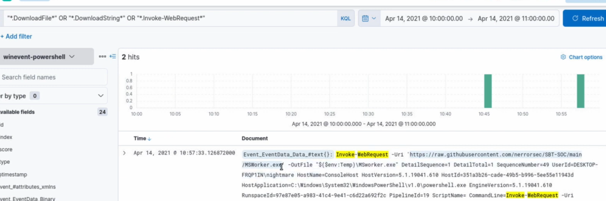
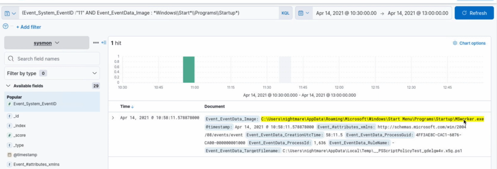
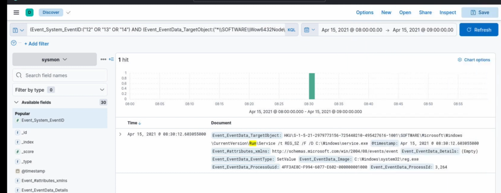
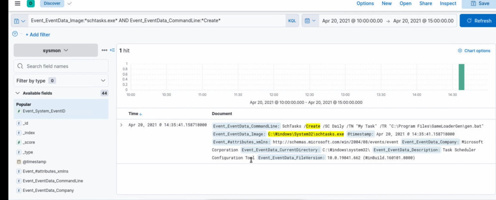

# SOC Alpha 1 — Walkthrough

**Platform:** Blue Team Labs Online (BTLO)
**Category:** ELK / Log Analysis / Network Analysis
**Technique:** T1569.002 (System Services: Service Execution)
**Difficulty:** Easy
**Points:** 25

## Scenario

As a SOC analyst, we're tasked with triaging alerts inside an ELK (Elasticsearch, Logstash, Kibana) SIEM. Kibana is accessible at `http://localhost:5601/`. Four alerts need to be investigated using Discover, with the correct index pattern, KQL query, and time range for each one, as defined in the lab's `README.txt`.

---

## Tools Used

- **Kibana Discover** — to query and inspect raw log events
- **KQL (Kibana Query Language)** — to filter events by field values
- Index patterns provided in the lab environment: `winevent-powershell`, `sysmon`

---

## Alert 1 — Suspicious PowerShell Download

**Source:** `winevent-powershell`
**Rule:** `*.DownloadFile*` OR `*.DownloadString*` OR `*Invoke-WebRequest*`
**Timeframe:** 14-4-2021 10:00 to 14-4-2021 11:00

### Investigation

In Kibana Discover, the index pattern was set to `winevent-powershell` and the time range was set explicitly to `Apr 14, 2021 @ 10:00:00.00 → Apr 14, 2021 @ 11:00:00.00` (an important step, since the default "Last 1 year" relative range did not cover this 2021 dataset). Using the rule's query, `*.DownloadFile*" OR "*.DownloadString*" OR "*Invoke-WebRequest*`, returned 2 hits.

Expanding the matching document revealed the full PowerShell command line, containing the cmdlet used and the source URL for the downloaded file.



### Answers

**Q1: What is the cmdlet used for downloading?**
```
Invoke-WebRequest
```

**Q2: What is the full URL from which the file is downloaded?**
```
https://raw.githubusercontent.com/nerrorsec/SBT-SOC/main/MSWorker.exe
```

---

## Alert 2 — Potential Persistence Mechanism (FileCreation)

**Source:** `sysmon`
**Rule:** `Event_System_EventID: "11" AND Event_EventData_Image: *Windows\Start*\Programs\Startup*`
**Timeframe:** 14-4-2021 10:30 to 14-4-2021 13:00

### Investigation

Switching the index pattern to `sysmon` and setting the time range to `Apr 14, 2021 @ 10:30:00.00 → Apr 14, 2021 @ 13:00:00.00`, the rule query returned 1 hit. The event's `Event_EventData_Image` field showed a file being dropped directly into the current user's Startup folder — a classic persistence technique, since anything placed there runs automatically at every login.



### Answer

**Q: What is the name of the suspicious EXE that is added for Persistence?**
```
MSWorker.exe
```

Path observed: `C:\Users\nightmare\AppData\Roaming\Microsoft\Windows\Start Menu\Programs\Startup\MSworker.exe`

---

## Alert 3 — Autorun Keys Modification

**Source:** `sysmon`
**Rule:** `(Event_System_EventID: ("12" OR "13" OR "14")) AND (Event_EventData_TargetObject: ("*\SOFTWARE\Wow6432Node\Microsoft\Windows*CE*Services\AutoStart*" OR "*\SOFTWARE\Wow6432Node\Microsoft\Active*Setup\Installed*Components*" OR "*\SOFTWARE\Microsoft\Windows*CE*Services\AutoStartOnDisconnect*" OR "*\SOFTWARE\Microsoft\Setup\CmdLine*" OR "\Software\Microsoft\Ctf\LangBarAddin*" OR "*\Software\Microsoft\Command*Processor\Autorun*" OR "*\Run*"))`
**Timeframe:** 15-4-2021 08:00 to 15-4-2021 09:00

### Investigation

With the `sysmon` index pattern and the time range set to `Apr 15, 2021 @ 08:00:00.00 → Apr 15, 2021 @ 09:00:00.00`, the registry-focused rule matched 1 hit. This event shows a registry `SetValue` operation on a `Run` key (`Event_EventData_EventType: SetValue`) — a common autorun persistence mechanism that launches a program every time a user logs in. The `Event_EventData_Details` field pointed to an executable being set to run automatically, and the `Event_EventData_TargetObject` field showed the full registry key path.



### Answers

**Q1: What is the name of the suspicious executable file involved?**
```
service.exe
```
(Full path: `C:\Windows\service.exe`)

**Q2: What is the name of the key path?**
```
Service
```
(Full registry target: `HKU\S-1-5-21-2979773156-725440210-495427616-1001\SOFTWARE\Microsoft\Windows\CurrentVersion\Run\Service`)

---

## Alert 4 — Suspicious Task Creation

**Source:** `sysmon`
**Rule:** `Event_EventData_Image: *schtasks.exe* AND Event_EventData_CommandLine: *Create*`
**Timeframe:** 20-4-2021 10:00 to 20-4-2021 15:00

### Investigation

With the index pattern still on `sysmon` and the time range set to `Apr 20, 2021 @ 10:00:00.00 → Apr 20, 2021 @ 15:00:00.00`, the rule matched 1 hit. The event's `Event_EventData_CommandLine` field showed `schtasks.exe` being used with the `/Create` flag to register a new scheduled task, specifying the task name (`/TN`) and the program to run (`/TR`) — a technique commonly used to establish persistence or execute a payload on a schedule.



### Answers

**Q1: What is the name of the task?**
```
My Task
```

**Q2: What is the full path of the program?**
```
C:\Program Files\GameLoaderGen\gen.bat
```

---

## Summary

| Alert | Technique | Key Finding |
|---|---|---|
| 1 | PowerShell Download (T1105) | `Invoke-WebRequest` pulled `MSWorker.exe` from a GitHub raw content URL |
| 2 | Startup Folder Persistence (T1547.001) | `MSWorker.exe` dropped into the user's Startup folder |
| 3 | Run Key Persistence (T1547.001) | `service.exe` registered under a `Run` registry key named `Service` |
| 4 | Scheduled Task (T1053.005) | Task `My Task` created to execute `gen.bat` from `GameLoaderGen` |

Overall, this lab traced a single intrusion chain: a PowerShell-based download of a malicious executable, followed by three separate persistence mechanisms (Startup folder, Run registry key, and a scheduled task) — all pointing to an attacker establishing durable access to the host.

## Lessons Learned

- Always match the **index pattern** to the log source specified in the alert rule (`winevent-powershell` vs `sysmon`) — querying the wrong index silently returns zero hits.
- Kibana's relative time filters (e.g. "Last 1 year") are relative to **today**, not the dataset's timestamps — for historical lab data, switch to **Absolute** time ranges matching the alert's stated timeframe.
- Expanding a matched document in Discover is essential to pull specific field values (cmdlet, URL, file path, registry key) needed to answer investigation questions.
