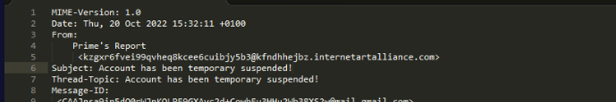
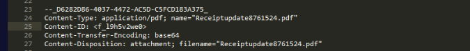
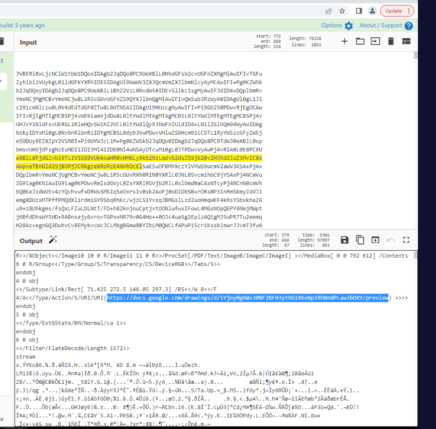
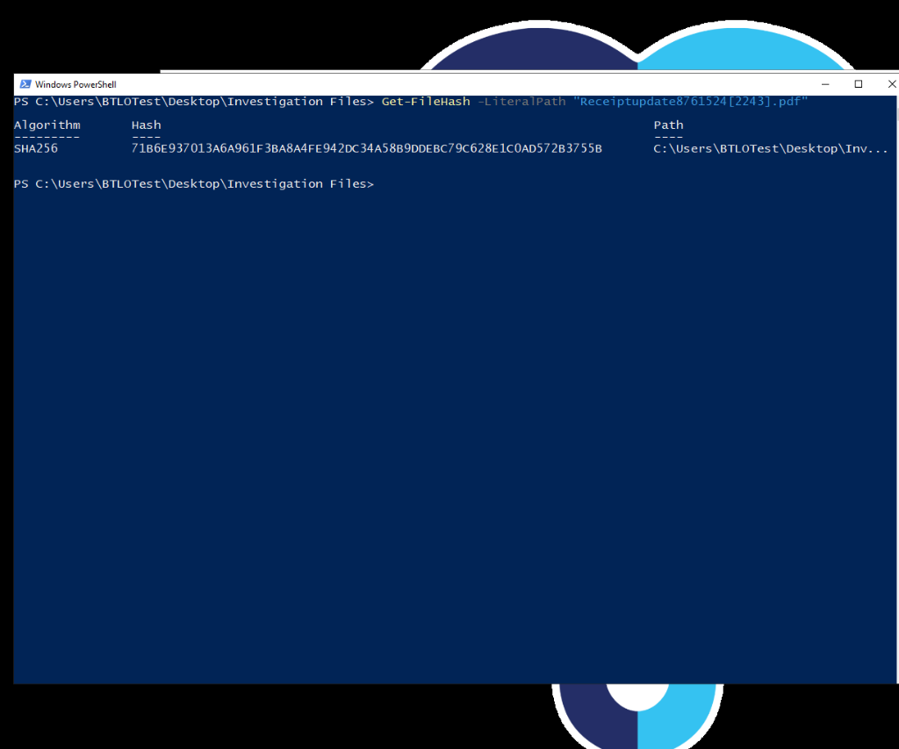
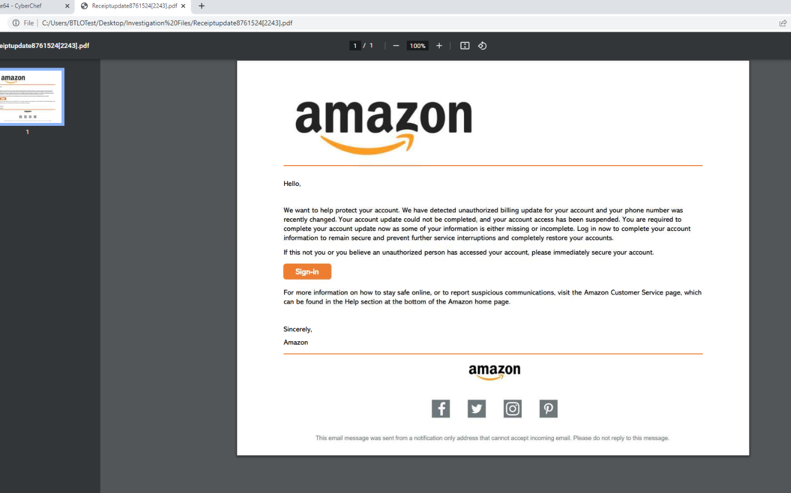
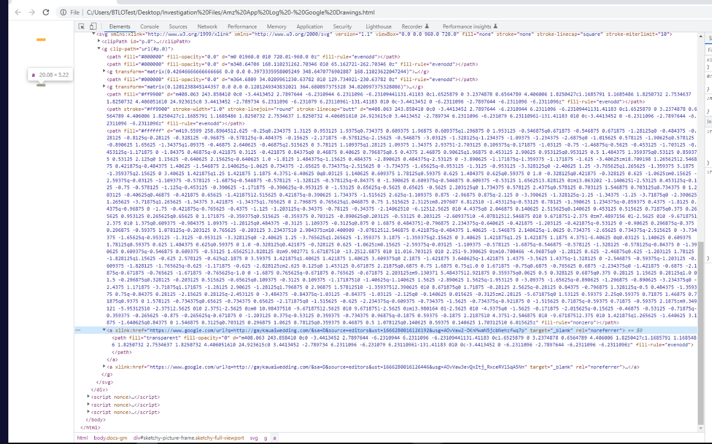
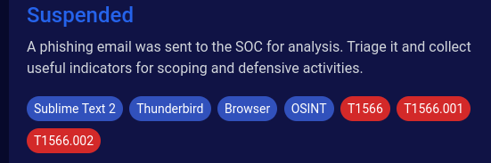

# Suspended — BTLO Investigation Walkthrough

> **Platform:** Blue Team Labs Online (BTLO)
> **Category:** Phishing / Email Triage · **Difficulty:** Easy
> **MITRE ATT&CK:** T1566 (Phishing), T1566.001 (Spearphishing Attachment), T1566.002 (Spearphishing Link)

---

## Scenario

> A phishing email was sent to the SOC for analysis. Triage it and collect useful indicators for scoping and defensive activities.

We're handed a `.eml` phishing email with a PDF attachment. The job is classic phishing triage: pull the scoping indicators (subject, sender, date, attachment name, file hash), decode the attachment to recover the embedded link, follow that link to the imitated brand and the real malicious destination, and map the activity to MITRE ATT&CK.

---

## Tools used

| Tool | Why |
|------|-----|
| **Sublime Text** | Read the raw `.eml` source — headers and the Base64 attachment block. |
| **Thunderbird** | (Optional) render the email as a victim would see it. |
| **CyberChef** | Decode the Base64 attachment back into a PDF / inspect its contents. |
| **PowerShell** (`Get-FileHash`) | Compute the SHA256 of the attachment. |
| **Browser + DevTools** | Render the saved phishing page and read the call-to-action button's real URL from the HTML source. |

---

## The investigation

### Q1 — What is the subject line of the email? *(2 pts)*

**Where to look:** the `Subject:` header in the raw `.eml`, viewed in a text editor.



The `Subject:` header reads it straight out. Note the (deliberately) poor grammar — "temporary" instead of "temporarily" — a classic phishing tell.

**Answer:** `Account has been temporary suspended!`

---

### Q2 — From name and mailbox used to send the email *(3 pts)* — Format: `From Name, mailbox@domain.tld`

**Where to look:** the `From:` header.

The header shows a friendly display name followed by the real envelope address in angle brackets:

```
From: Prime's Report <kzgxr6fvei99qvheq8kcee6cuibjy5b3@kfndhhejbz.internetartalliance.com>
```

The display name (`Prime's Report`) is attacker-chosen and meaningless; the long random local-part and the unrelated `internetartalliance.com` domain are strong indicators of a throwaway/compromised sender — exactly the kind of address you'd block and pivot on.

**Answer:** `Prime's Report, kzgxr6fvei99qvheq8kcee6cuibjy5b3@kfndhhejbz.internetartalliance.com`

---

### Q3 — Value of the Date property *(2 pts)* — Format: `Date Value`

**Where to look:** the `Date:` header.


**Answer:** `Thu, 20 Oct 2022 15:32:11 +0100`

---

### Q4 — Filename of the attachment *(2 pts)* — Format: `filename.ext`

**Where to look:** the MIME attachment part — `Content-Type` / `Content-Disposition` headers within the `.eml`.



```
Content-Type: application/pdf; name="Receiptupdate8761524.pdf"
Content-Disposition: attachment; filename="Receiptupdate8761524.pdf"
```

This is the filename to hunt for in EDR to see which endpoints pulled it down.

**Answer:** `Receiptupdate8761524.pdf`

---

### Q5 — URL contained within the PDF *(3 pts)* — Format: `http/s://domain/tld/something`

**Where to look:** the attachment is stored in the email as a Base64 blob. Copy that Base64, paste it into **CyberChef**, apply **`From Base64`**, then search the decoded output for `http`.



In the decoded PDF stream, the link object (`/Type /Action /S /URI /URI (...)`) reveals the embedded URL:

**Answer:** `https://docs.google.com/drawings/d/1Yjoy0g6WvJ0NF2BFH3ythG186xNpIRhNn8PLaw3bUXY/preview`

> Long IDs are easy to mistype — copy the exact string from your own CyberChef output rather than transcribing by eye.

---

### Q6 — SHA256 hash of the attachment *(2 pts)* — Format: `SHA256`

**Where to look:** the real file saved in `Desktop\Investigation Files\`, hashed with PowerShell.

The filename contains square brackets (`Receiptupdate8761524[2243].pdf`). In PowerShell, `[` and `]` are wildcard characters, so a plain `Get-FileHash` silently matches nothing. Use **`-LiteralPath`** to take the name exactly as written:

```powershell
Get-FileHash -LiteralPath "Receiptupdate8761524[2243].pdf"
```



**Answer:** `71B6E937013A6A961F3BA8A4FE942DC34A58B9DDEBC79C628E1C0AD572B3755B`

> The hash is computed over the file's **bytes**, not its extension — it's your fingerprint for a reputation lookup (e.g. VirusTotal) regardless of what the file claims to be.

---

### Q7 — What company is the document imitating? *(2 pts)* — Format: `Company Name`

**Where to look:** open the PDF and look at the branding.



The PDF impersonates **Amazon** — logo, "account suspended / unauthorized billing update" pretext, and a fake **Sign-In** call-to-action button. Standard credential-harvesting lure.

**Answer:** `Amazon`

---

### Q8 — Full URL of the call-to-action button *(3 pts)* — Format: `Full URL`

**Where to look:** the saved web page file for the URL destination (`Amz App Log - Google Drawings.html`). Open it in a text editor or via DevTools **Elements**, and inspect the `<a>` wrapping the **Sign-in** button.



The button is an `<a>` whose `href` is a **Google redirect wrapper** — the real destination is tucked inside the `q=` parameter:

**Answer:**
```
https://www.google.com/url?q=http://gaykauaiwedding.com/&sa=D&source=editors&ust=1666280016126192&usg=AOvVaw2-OKnMwaN5jcbNehzfwq7p
```

> The `&amp;` you see in the raw source is just HTML-encoding for `&` — the actual separators are plain `&`. Redirect services like `google.com/url?q=` are a common trick to make a malicious link look trustworthy; the true target always lives in `q=`.

---

### Q9 — Domain name of the site the button leads to *(2 pts)* — Format: `domain.tld`

**Where to look:** decode the `q=` parameter from Q8 (or just click the button and let it fail to load — no internet is fine).


Stripping the Google wrapper leaves `http://gaykauaiwedding.com/`, so the domain is:

**Answer:** `gaykauaiwedding.com`

---

### Q10 — Which two Phishing sub-techniques are used? *(4 pts)* — Format: `TXXXX.XXX, TXXXX.XXX`

**Where to look:** MITRE ATT&CK, technique **T1566 (Phishing)**, and match the sub-techniques to what this actor actually did.



This actor used **both**:

- **T1566.001 — Spearphishing Attachment** → the malicious PDF (`Receiptupdate8761524.pdf`).
- **T1566.002 — Spearphishing Link** → the credential-harvesting link embedded inside that PDF.

**Answer:** `T1566.001, T1566.002`

---

## Answer key

| # | Question | Answer |
|---|----------|--------|
| 1 | Subject line | `Account has been temporary suspended!` |
| 2 | From name, mailbox | `Prime's Report, kzgxr6fvei99qvheq8kcee6cuibjy5b3@kfndhhejbz.internetartalliance.com` |
| 3 | Date property | `Thu, 20 Oct 2022 15:32:11 +0100` |
| 4 | Attachment filename | `Receiptupdate8761524.pdf` |
| 5 | URL inside the PDF | `https://docs.google.com/drawings/d/1Yjoy0g6WvJ0NF2BFH3ythG186xNpIRhNn8PLaw3bUXY/preview` |
| 6 | SHA256 of the attachment | `71B6E937013A6A961F3BA8A4FE942DC34A58B9DDEBC79C628E1C0AD572B3755B` |
| 7 | Company imitated | `Amazon` |
| 8 | Full URL of call-to-action button | `https://www.google.com/url?q=http://gaykauaiwedding.com/&sa=D&source=editors&ust=1666280016126192&usg=AOvVaw2-OKnMwaN5jcbNehzfwq7p` |
| 9 | Destination domain | `gaykauaiwedding.com` |
| 10 | Phishing sub-techniques | `T1566.001, T1566.002` |

---

## Key takeaways

- **Read emails as raw source, not rendered.** Headers (`Subject`, `From`, `Date`) and the Base64 attachment block all live in the `.eml` text — a renderer hides exactly the indicators you need to scope an incident.
- **Decode, don't trust.** The PDF's link only surfaces after Base64-decoding the attachment; encoded ≠ hidden.
- **`-LiteralPath` for awkward filenames.** Square brackets are PowerShell wildcards — without `-LiteralPath`, `Get-FileHash` matches nothing and returns silently.
- **Always unwrap redirects.** `google.com/url?q=` (and similar) disguise the real destination; the malicious domain is in the `q=` parameter.
- **Map behaviour to ATT&CK precisely.** Attachment *and* embedded link means two distinct sub-techniques (.001 and .002), not just the parent T1566.

---

*Suspended: triaged and closed.*
